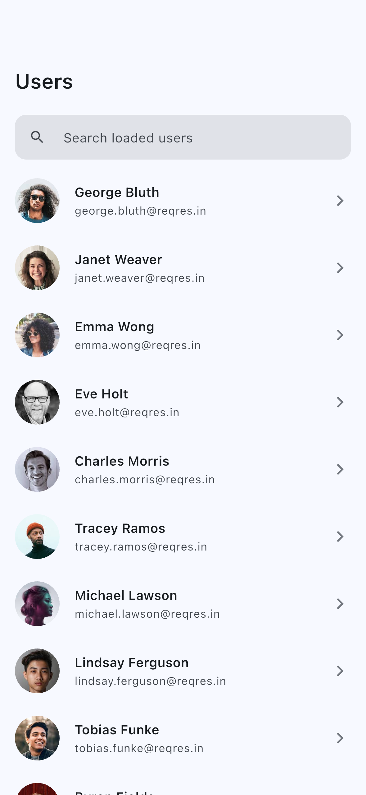
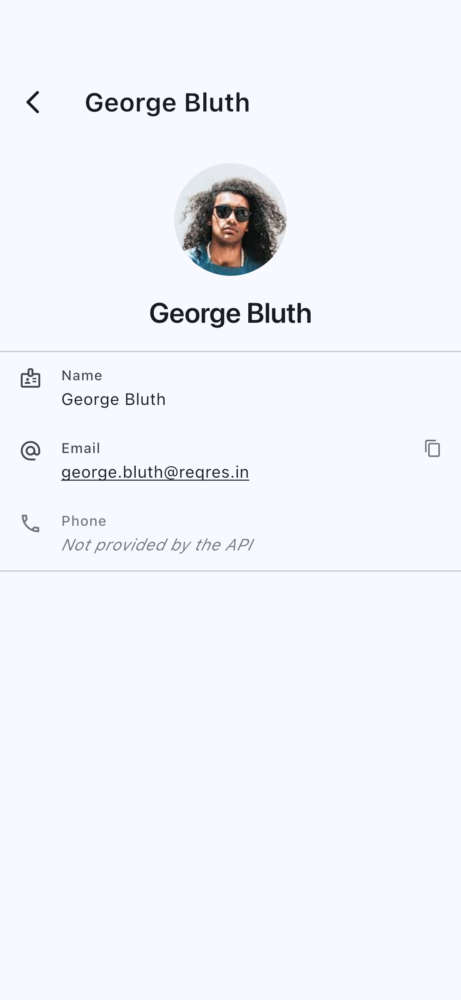
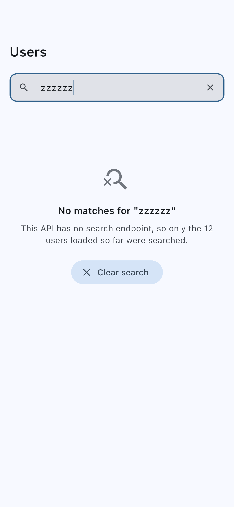

# Users

A paginated users browser built with Clean Architecture, `flutter_bloc`, Dio
and Hive — with offline caching, client-side search, and explicit handling of
the places where the assignment brief and the APIs disagree.

## Screenshots

| List (light) | List (dark) | Detail |
|---|---|---|
|  |  |  |

| Search | No results |
|---|---|
|  |  |

Captured by `flutter drive` against the running app
(`integration_test/screenshots_test.dart`), so they cannot drift from the UI.

---

## Setup

```bash
git clone <repo-url>
cd elyx_digital_assignment

flutter pub get

# Regenerates Hive TypeAdapters and Mockito mocks. Generated files ARE
# committed, so this is only needed after changing a @HiveType model or a
# @GenerateMocks list.
dart run build_runner build

flutter run
```

Requires Flutter **3.41+** / Dart **3.11+**.

### Switching data source

```bash
flutter run                                   # reqres.in  (default)
flutter run --dart-define=API_SOURCE=github   # api.github.com
```

`reqres.in` is the default because it is the API the brief names in prose, and
the only one of the two that paginates the way the brief specifies
(`?per_page=10&page=1`). It returns a fixed 12-user dataset, so infinite scroll
terminates after two pages — that is the dataset, not a defect.

`api.github.com` is the opt-in alternative: live data, millions of users, and a
cursor-based `?since=` scheme. It is unauthenticated by default
(60 requests/hour per IP). To raise that to 5,000:

```bash
flutter run --dart-define=GITHUB_TOKEN=ghp_xxx
```

### The reqres API key

`reqres.in` has required an API key since 2025; without it requests return
`401 {"error":"missing_api_key"}`. The free public key is compiled in as the
default, so `--dart-define=API_SOURCE=reqres` needs no further configuration.
To supply a different one:

```bash
flutter run --dart-define=API_SOURCE=reqres --dart-define=REQRES_API_KEY=your-key
```

> `--dart-define` values are compiled into the binary and are recoverable from
> a release build. Fine for a read-only public-data token; not a mechanism for
> real secrets. `env.json` is git-ignored; `env.example.json` is the template.

---

## Release builds

Release builds are signed with a real upload key, minified and resource-shrunk
(R8), and must never be shipped with the debug key.

### Signing

`android/key.properties` and the `.jks` are git-ignored; `key.properties.example`
is the committed template. Generate a keystore once:

```bash
keytool -genkeypair -v -keystore android/app/upload-keystore.jks \
  -keyalg RSA -keysize 2048 -validity 10000 -alias upload
```

Then copy `android/key.properties.example` to `android/key.properties` and fill
it in. If that file is absent the build falls back to debug signing **and prints
a warning** — it does not fail, so a fresh clone still builds, but the output is
not publishable.

### Building

```bash
flutter build appbundle --release        # for Play Store (preferred)
flutter build apk --release --split-per-abi   # ~16-20 MB per ABI
```

A universal APK is ~52 MB because it carries every ABI; the split APKs are
15.8 MB (armeabi-v7a), 18.3 MB (arm64-v8a) and 19.6 MB (x86_64). Play delivers
the right one automatically from the AAB.

> Stripping debug symbols from the native libraries needs a complete Android
> SDK. If `flutter doctor` reports `cmdline-tools component is missing`, the
> bundle still builds but keeps its symbols and is larger than it should be.

### CI

`.github/workflows/ci.yml` runs format, `analyze --fatal-infos` and the full
test suite with coverage on every push and PR, then builds a release AAB.
Signing in CI reads four repository secrets — `KEYSTORE_BASE64`,
`STORE_PASSWORD`, `KEY_PASSWORD` and `KEY_ALIAS`; without them the build step
still runs and falls back to debug signing.

### Error reporting

Every uncaught error funnels through `ErrorReporter`
(`lib/core/observability/error_reporter.dart`), wired in `main()` to
`FlutterError.onError`, `PlatformDispatcher.onError` and the guarded zone. The
default implementation logs through `dart:developer` in **all** build modes and
keeps a bounded breadcrumb ring buffer. Adding Crashlytics or Sentry means
writing one more `ErrorReporter` and passing it to `di.init` — no call site
changes.

---

## DESIGN DECISIONS

### 1. Which API? Both — the brief contradicts itself

The brief's **prose** says:

> *Networking: Use Dio or http package to fetch data from `https://reqres.in/api/users`*

Its **hyperlinks**, however, resolve to `api.github.com`. These are not
interchangeable: they disagree about pagination, about what a list response
contains, and about authentication.

Rather than guess which was intended, **both are implemented behind one
interface** and selected at build time, with **reqres as the default** — the
brief's prose is what it actually asks for, and reqres is the only one of the
two that paginates by `?per_page=10&page=1` as specified. GitHub is one
`--dart-define` away for anyone who wants live data:

```dart
abstract interface class UsersApi {
  String get baseUrl;
  Map<String, String> get headers;
  Future<PaginatedUsers> fetchUsers({Object? cursor, int perPage});
  Future<UserDetail> fetchUserDetail(String id);
}
```

| | reqres.in (default) | api.github.com |
|---|---|---|
| Pagination | `?page=N&per_page=10`, `total_pages` in the body | `?since={id}` cursor, next page in the `Link` header |
| List contains | `first_name`, `last_name`, `email`, `avatar` | `login`, `avatar_url` — **no name, no email** |
| Detail shape | `{"data": {…}}` envelope | flat object |
| Auth | **required** `x-api-key` header | optional Bearer token |
| Dataset | 12 users, 2 pages | millions |

Everything above the data layer is unaware of which is active. The cursor is
`Object?` and opaque — a page number for one, a user id for the other — and the
Bloc stores it and hands it back without inspecting it. This is the one place
the architecture genuinely earns its keep: supporting a second, structurally
incompatible backend changed the data layer and nothing else.

**reqres returns 12 users in total.** Infinite scroll therefore terminates
after two pages and shows *"You've reached the end"*. That is the dataset, not
a defect — switch to `API_SOURCE=github` to scroll indefinitely.

Because either source may be active, nothing in `core/error` names a vendor:
failure messages say *"the server"*, and only the two `UsersApi`
implementations mention reqres or GitHub by name.

### 2. Two entity shapes, one neutral type

GitHub's list response has no name and no email; reqres's does. A single
entity with everything non-null would be a lie for one source, and two parallel
entity trees would double every layer above.

`UserSummary` holds the union as nullables and exposes `displayName`, which
falls back **name → handle → id** and is therefore never blank. `UserDetail`
composes it and marks every GitHub-only field (`bio`, `publicRepos`, …)
nullable, with `hasStats` letting the UI hide the counters row entirely rather
than render three zeros — which would be fabricated data.

### 3. The phone field

The assignment asks the detail screen to show a phone number. **Neither API
has one.** reqres returns `id`, `email`, `first_name`, `last_name`, `avatar`;
GitHub has no phone concept at any scope, authenticated or not.

The screen **always renders a Phone row**, styled as unavailable — muted,
italic, non-interactive — reading *"Not provided by the API"*. It is never
hidden, because hiding it would make the gap invisible and leave a reviewer
unable to tell "the API has no phone number" from "the candidate forgot it".

The app does **not** generate a placeholder, not even a deterministic one. A
fabricated value that looks like a phone number is indistinguishable from real
data on screen. To make that impossible rather than merely discouraged, there
is **no `phone` field on any entity or model** — the row has nothing to read
from, by construction, and a test asserts the entity's field count to catch
anyone adding one.

The same reasoning governs `email` when the source omits it: *"Not publicly
listed"*, never blank.

### 4. Search is client-side

Neither source offers a server-side name filter. So search filters what has
already been paged in, matching `displayName` **and** `email`.

Two consequences handled explicitly:

- **`contains()`, never `RegExp`.** A user typing `a|b`, `(`, or a trailing
  `\` would either throw a `FormatException` at compile time or silently
  succeed as a pattern and return wrong matches. `contains()` has no pattern
  semantics, so every character is literal by construction rather than by
  vigilance. All 13 metacharacters have tests.
- **"No results" never implies the user does not exist.** The empty state says
  *"This API has no search endpoint, so only the 12 users loaded so far were
  searched"* and offers **Load more** — because client-side filtering cannot
  know what exists server-side.

### 5. Cache-then-network with stale fallback

One class decides where data comes from, in this order:

| # | Condition | Behaviour |
|---|---|---|
| 1 | Fresh cache (within TTL), not a forced refresh | Serve it. **Zero requests.** |
| 2 | Offline | Serve cache at **any** age; fail only if there is none |
| 3 | Stale cache + online, or forced refresh | Go remote |
| 4 | Remote succeeded, forced refresh | **Invalidate every cached batch**, then cache and return |
| 5 | Remote succeeded, ordinary read | Cache, then return |
| 6 | Remote failed, ordinary read | Fall back to stale cache; surface the failure only if nothing is cached |
| 7 | Remote failed, forced refresh | Surface the failure; the Bloc keeps the existing rows on screen |
| 8 | Empty batch | `hasReachedEnd: true` — a **success**, not a failure |

TTLs: **15 minutes** for list batches, **6 hours** for profiles. The profile
cache is bounded — expired entries are evicted on write, then oldest-by-write
above 200 — because a TTL controls freshness, not size.

The invalidation in step 4 is not optional: overwriting only the requested
batch leaves later pages holding pre-refresh data, so within the TTL the user
scrolls straight back into the rows they just pulled to replace.

**It is deliberately the last thing that happens, not the first.** Clearing up
front — before the connectivity check — means a pull-to-refresh in airplane
mode destroys the only copy of the data the user could still be shown, and
returns an error having deleted the answer. The cache is dropped only once its
replacement is in hand. Three regression tests cover it, each verified to fail
against the earlier ordering.

On cold start the list is seeded from **everything ever cached**, so offline
search covers previous sessions rather than only the current one.

---

## Architecture

```
┌──────────────────────────────────────────────┐
│  presentation   pages · widgets · blocs      │
│                 depends on: domain           │
├──────────────────────────────────────────────┤
│  domain         entities · repository        │──► depends on NOTHING
│                 contracts · use cases        │
├──────────────────────────────────────────────┤
│  data           UsersApi impls · Hive models │
│                 repository impl              │
│                 depends on: domain           │
└──────────────────────────────────────────────┘
        core/  ── shared infrastructure, no feature knowledge
```

`package:dio` is confined to `core/network` plus `core/error/error_mapper.dart`
— enforced by `test/architecture/dio_boundary_test.dart`, which fails the build
if it leaks.

**State management** is `flutter_bloc`, chosen because this screen's behaviour
is a sequence of discrete events with real concurrency rules, and Bloc's event
transformers express them declaratively: `droppable()` makes a fast scroll
fling issue **one** request instead of three, and `restartable() + 300ms`
debounces search. A boolean `_isLoading` guard is forgettable on an early
return; a transformer is not.

Transformers only serialise requests **within one event type**, though, and a
refresh and an append are different events. So `UsersBloc` also carries a
`_generation` counter, bumped whenever the list is replaced wholesale. A page
request that started before a refresh finds its generation stale and discards
its result — without it the pre-refresh page appends onto the refreshed list
and drags the cursor back to the older sequence, so pagination resumes from
rows the user has already seen.

The list uses **one flat state class with a status enum**, not a sealed union.
The deciding case is a failure mid-scroll: a union either discards the 40 users
already on screen or copies them into every variant anyway. A status field
keeps *"40 loaded AND the last page failed"* representable, which is what an
inline footer error needs.

---

## Problem scenarios

| Scenario | How it is handled | Where |
|---|---|---|
| Slow API response | 10s connect / 15s receive timeouts → `TimeoutFailure`; skeleton rows, not a bare spinner | `dio_client.dart`, `loading_view.dart` |
| No internet + retry | Cache served at any age; `NetworkFailure` + Retry when empty; persistent offline banner | `user_repository_impl.dart`, `offline_banner.dart` |
| Empty API response | `hasReachedEnd: true` — a success; friendly "No users available" | `paginated_users.dart`, `empty_view.dart` |
| Search special characters | `contains()`, never `RegExp`; trim + whitespace collapse; 13 metacharacter tests | `filter_users.dart` |
| Back navigation / leaks | Blocs are factories; `BlocProvider` closes on pop; `isClosed` after every await; controllers disposed | `injection_container.dart`, `users_bloc.dart`, `users_list_view.dart` |
| UI responsiveness | M3 window size classes; list ↔ 2/3-column grid ↔ two-pane split view; `PageStorageKey` preserves scroll on rotation; text scale to 2.0 | `responsive.dart`, `users_list_view.dart`, `users_split_view.dart` |
| Stale cached data | TTLs + `forceRefresh` invalidation; bounded profile cache; schema-version guard drops incompatible boxes | `user_repository_impl.dart`, `hive_initializer.dart` |
| Refresh while offline | Cache is invalidated only *after* a replacement arrives, so the gesture cannot destroy the last copy | `user_repository_impl.dart` |
| Refresh racing an in-flight page | `_generation` counter discards the overtaken request instead of splicing two list snapshots | `users_bloc.dart` |
| Pop during a pull-to-refresh | `firstWhere` on a closing Bloc stream is caught, so `RefreshIndicator` ends quietly | `users_list_view.dart` |
| Infinite scroll stalls on tall screens | Post-frame viewport fill, guarded so it cannot loop | `users_list_view.dart` |
| Rate limiting / 429 | Distinct failure carrying `resetAt`; countdown with Retry **disabled**; no further requests until reset | `rate_limit_interceptor.dart`, `users_state.dart` |
| Deleted account (404) | `NotFoundFailure` — the one failure that must **not** fall back to cache | `user_repository_impl.dart` |
| Malformed record | Coercing parsers + `whereType`; one bad record never discards the batch | `reqres_users_api.dart` |
| Corrupt cache on launch | Box deleted and recreated rather than crashing before `runApp` | `hive_initializer.dart` |
| Unknown route | Type-checked arguments → 404 page, not an exception | `route_generator.dart` |

---

## Testing

```bash
flutter test
flutter test --coverage
genhtml coverage/lcov.info -o coverage/html && open coverage/html/index.html
```

Mocks come from one declaration file:

```dart
@GenerateMocks(<Type>[UsersApi, UserLocalDataSource, NetworkInfo, UserRepository])
void main() {}
```

Notable coverage: an **architecture test** failing the build if Dio leaks past
`core/network`; **end-to-end API tests** faking only the socket, so the real
interceptor chain, error mapper and Link parser execute; **Hive tests against
real boxes** in a temp directory; and **regression tests** for three bugs found
on a device — a retry storm, a footer overflow, and a full-screen state
overflowing a short viewport — each verified to fail against the pre-fix code.

---

## Known limitations

1. **Both sources were exercised against their live APIs during development**,
   but the device screenshots come from the reqres build only.
2. **`hive_generator` is unusable on this SDK** (it pins `analyzer <7.0.0`,
   which cannot coexist with `bloc_test`), so the project uses **`hive_ce`** —
   the maintained fork, same API and same `@HiveType` annotations.
3. **Diacritics are not folded in search.** `"jose"` will not match `"José"`.
   Dart ships no Unicode normaliser in core. This is a real limitation now that
   search covers free-form display names, and would be the first thing I fixed
   on a non-Anglophone dataset.
4. **Links copy to the clipboard** rather than opening a browser.
   `url_launcher` needs an Android `<queries>` manifest entry to work on API
   30+, which cannot be verified without a device.
5. **No localisation.** Copy is centralised in `UsersStrings` — which is the
   seam an ARB-based setup would replace — but is hardcoded English, and
   `formatClockTime` does not respect a 24-hour locale preference.
6. **The launcher icon is a generated placeholder**, not a designed mark.
7. **Widget tests never close their blocs.** `Bloc.close()` never completes
   inside `testWidgets` (its clock is faked); it completes normally in plain
   `test()` and `bloc_test`. Documented at the top of each affected file.
